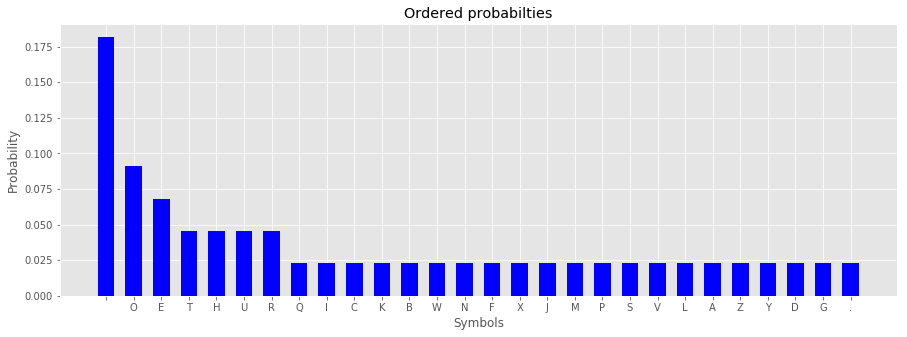
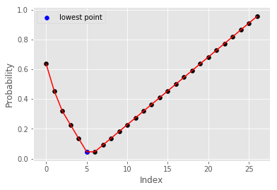
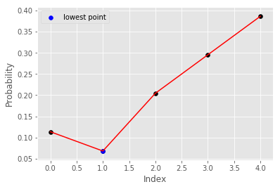
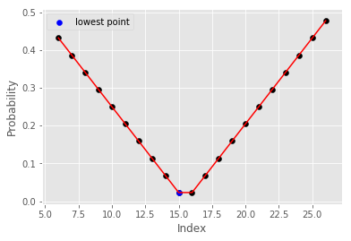
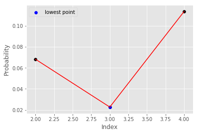
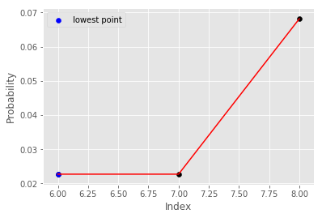
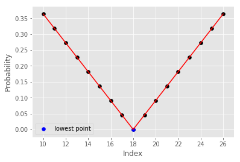
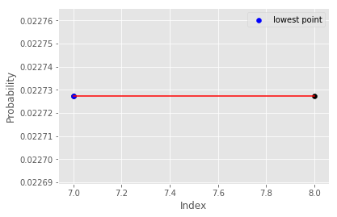

# Shannon-Fano-Coding
This program is created to understand how Shannon Fano Coding works. 

# Iterations for getting index with lowest difference between two probability list.

# Final codeword

